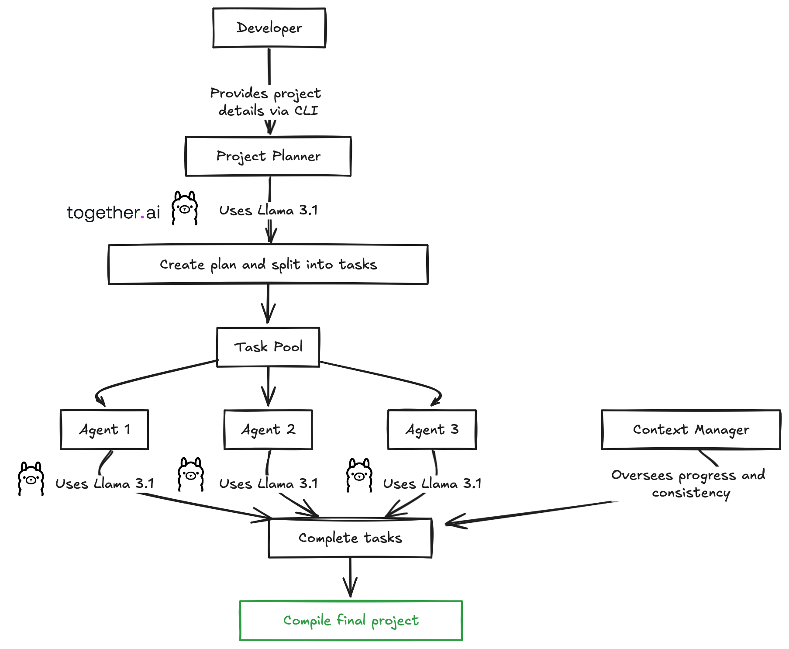

# dev-ai-agent
agent based project scaffolding and building framework.
Not like a typical coding agent where you get help on existing project.
Here you can scaffold a project and build on top of it using AI of your choice.
LLAMA 3.1, Open AI, Claude Sonnet etc

## Instructions to install the dependencies 

### rename .env.example with .env
### provide your api keys if you want to use open-ai
```
- node .src/index.js
- npm install 
- npm link
    - then run "dev-ai" cli from anywhere of the terminal 
```
## Want to contribute ?

- Create a PR for the existing [issues](https://github.com/dev-ai-agent/dev-ai-agent/issues)
- Create issue for feature requests and bugs. We will work on this ASAP to fix it. [Project page](https://github.com/orgs/dev-ai-agent/projects/1)


## Architecture:




## Demo video 
link : https://drive.google.com/file/d/1vHCobBLiFTpfnp9BrNf3HYGlb74tRUn0/view?usp=sharing 

## Example promt for demo
1. Create a to-do app using Next.js, and Tailwind CSS with a single page named 'Dashboard' consume To-doWrapper component with CRUD (Create, Read, Update, Delete) operations on to-do items with api created; include an input field and button for adding items, display items in a list format with options to edit, delete, and mark as completed using a checkbox; ensure real-time updates for adding, editing, and deleting items, and organize the code using functional components with comments for clarity. develop end to end app and wrapper component with entire app fully function

2. Create a social media app using Next.js and Tailwind CSS, designed for personal use on a single page named 'Dashboard.' Implement a PostWrapper component with CRUD (Create, Read, Update, Delete) operations for posts. Include an input field for adding a text message and a file upload button for adding an image to each post. Display posts in a feed format, showing text and images with options to edit, delete, and like posts. Implement real-time updates for adding, editing, and deleting posts. Organize the code using functional components with comments for clarity and build the app end-to-end, including the PostWrapper component, to ensure a fully functional personal social media dashboard.
